# 十六进制编辑器设计文档

## 1. 概述

### 1.1 项目目标
构建一个面向开发者的十六进制编辑器桌面应用程序,支持macOS平台,提供直观的界面用于查看和编辑二进制数据,辅助开发和调试工作。

### 1.2 核心价值
- 提供专业的十六进制和ASCII双向编辑能力
- 支持灵活的数据源(文件或剪贴板)
- 提供高效的搜索和替换功能
- 采用原生macOS风格,提供一致的用户体验
- 支持多种字符编码格式

### 1.3 技术栈
- **框架**: Flutter桌面应用
- **UI组件库**: macos_ui (macOS原生风格)
- **窗口管理**: window_manager (自定义标题栏和窗口控制)
- **目标平台**: macOS

## 2. 架构设计

### 2.1 整体架构

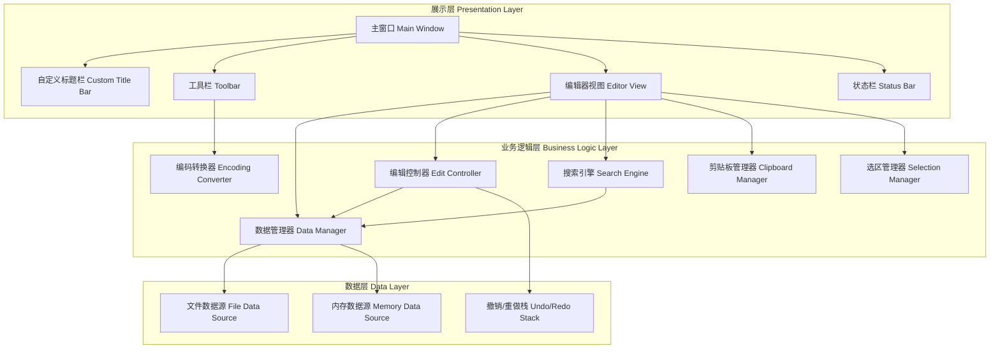

### 2.2 分层职责

| 层级 | 职责 | 关键组件 |
|------|------|----------|
| 展示层 | 用户界面渲染、用户交互响应 | 窗口组件、编辑器视图、工具栏 |
| 业务逻辑层 | 编辑逻辑、搜索算法、编码转换 | 数据管理器、编辑控制器、搜索引擎 |
| 数据层 | 数据持久化、数据状态管理 | 文件源、内存源、历史记录 |

## 3. 组件架构

### 3.1 组件层次结构

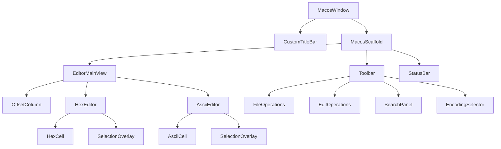

### 3.2 核心组件定义

#### 3.2.1 主窗口组件 (MacosWindow)

| 属性 | 说明 |
|------|------|
| 窗口标题 | 显示应用名称和当前文件名 |
| 窗口尺寸 | 初始尺寸1200x800,可调整 |
| 标题栏模式 | 隐藏系统标题栏,使用自定义实现 |

#### 3.2.2 自定义标题栏 (CustomTitleBar)

**功能特性**:
- 窗口拖动区域:整个标题栏可拖动移动窗口
- 窗口控制按钮:关闭、最小化、最大化(macOS风格)
- 文件路径显示:当前打开文件的完整路径
- 拖放区域:支持拖放文件到标题栏打开

#### 3.2.3 编辑器主视图 (EditorMainView)

**布局结构**:

**列定义表**:

| 列名称 | 宽度比例 | 内容 | 对齐方式 |
|--------|----------|------|----------|
| 偏移地址列 | 固定120px | 每行起始地址(十六进制) | 右对齐 |
| 十六进制区域 | 60% | 每行16字节的十六进制值 | 等宽字体,左对齐 |
| ASCII明文区域 | 剩余空间 | 每行16字节的ASCII字符 | 等宽字体,左对齐 |

#### 3.2.4 十六进制编辑区 (HexEditor)

**数据组织**:
- 每行显示16个字节
- 每个字节显示为两位十六进制数
- 字节之间用空格分隔
- 每8个字节用较大间距分组

**交互行为**:
- 可编辑:点击任意字节进入编辑模式
- 输入验证:仅接受0-9和A-F字符
- 实时同步:编辑后立即同步到ASCII区域
- 光标导航:支持方向键、Tab键导航

#### 3.2.5 ASCII明文编辑区 (AsciiEditor)

**显示规则**:
- 可打印字符:直接显示
- 控制字符和不可打印字符:显示为"."
- 与十六进制区域字节一一对应

**交互行为**:
- 可编辑:点击任意字符进入编辑模式
- 输入约束:根据当前编码限制输入
- 实时同步:编辑后立即同步到十六进制区域

#### 3.2.6 工具栏 (Toolbar)

**按钮组定义**:

| 按钮组 | 按钮 | 功能 |
|--------|------|------|
| 文件操作 | 打开文件 | 弹出文件选择器,加载文件到编辑器 |
| 文件操作 | 保存 | 保存当前修改到原文件 |
| 文件操作 | 另存为 | 选择新路径保存 |
| 编辑操作 | 撤销 | 撤销上一步操作 |
| 编辑操作 | 重做 | 重做已撤销的操作 |
| 编辑操作 | 粘贴数据 | 从剪贴板粘贴文本数据进入编辑器 |
| 搜索工具 | 查找 | 打开查找面板 |
| 搜索工具 | 替换 | 打开查找替换面板 |
| 设置 | 编码选择 | 下拉菜单选择字符编码 |

#### 3.2.7 状态栏 (StatusBar)

**显示信息**:

| 信息项 | 说明 |
|--------|------|
| 文件大小 | 显示当前数据总字节数 |
| 光标位置 | 当前光标所在的偏移地址 |
| 选中范围 | 选中数据的起始和结束地址,及总字节数 |
| 当前编码 | 正在使用的字符编码名称 |
| 修改状态 | 显示是否有未保存的修改 |

## 4. 核心功能设计

### 4.1 数据源管理

#### 4.1.1 数据源类型

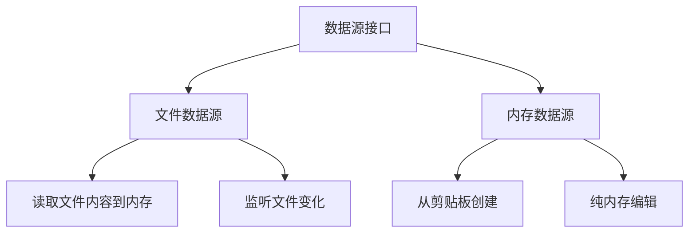

#### 4.1.2 数据源切换流程

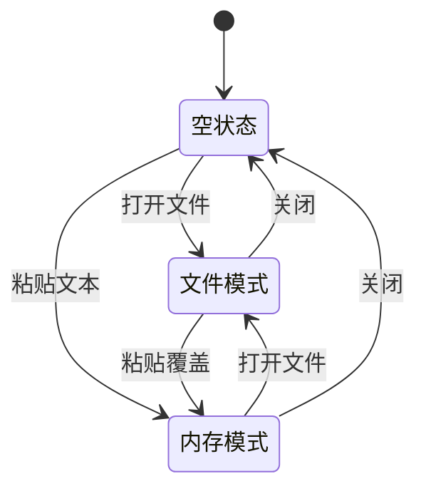

### 4.2 双向编辑同步机制

#### 4.2.1 同步策略

**十六进制区域 → ASCII区域**:
1. 捕获十六进制输入事件
2. 验证输入是否为合法十六进制字符
3. 更新底层字节数据
4. 根据当前编码将字节转换为字符
5. 刷新ASCII区域对应位置显示

**ASCII区域 → 十六进制区域**:
1. 捕获字符输入事件
2. 根据当前编码将字符转换为字节序列
3. 更新底层字节数据
4. 刷新十六进制区域对应位置显示

#### 4.2.2 同步流程图

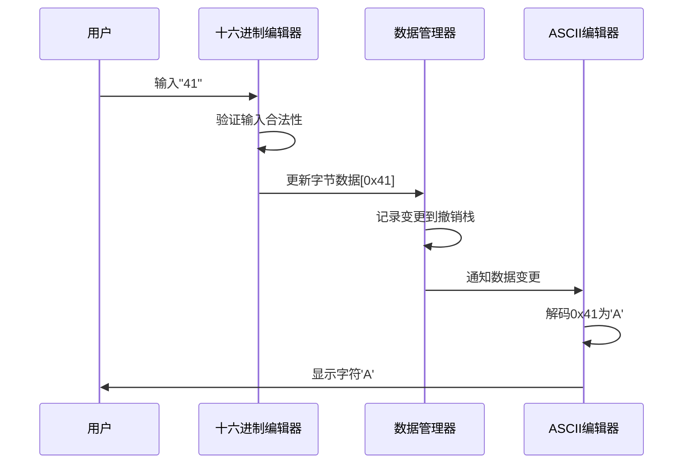

### 4.3 选区管理

#### 4.3.1 选区状态定义

| 属性 | 类型 | 说明 |
|------|------|------|
| 起始偏移 | 整数 | 选区开始的字节偏移 |
| 结束偏移 | 整数 | 选区结束的字节偏移 |
| 选区类型 | 枚举 | 十六进制选区/ASCII选区 |
| 是否激活 | 布尔 | 当前是否有激活的选区 |

#### 4.3.2 选区操作

**鼠标选择流程**:
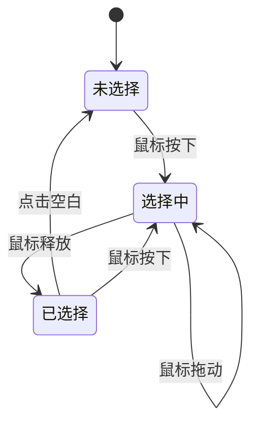

**键盘选择**:
- Shift + 方向键:扩展或收缩选区
- Cmd + A:全选
- Escape:取消选区

#### 4.3.3 右键菜单

**菜单项定义**:

| 菜单项 | 快捷键 | 功能 | 可用条件 |
|--------|--------|------|----------|
| 复制 | Cmd+C | 复制选中字节到剪贴板 | 存在选区 |
| 复制为十六进制 | Cmd+Shift+C | 复制为十六进制字符串格式 | 存在选区 |
| 剪切 | Cmd+X | 剪切选中字节 | 存在选区 |
| 粘贴 | Cmd+V | 在光标位置粘贴 | 剪贴板有数据 |
| 删除 | Delete | 删除选中字节 | 存在选区 |
| 填充 | - | 用指定字节填充选区 | 存在选区 |
| 插入 | - | 在当前位置插入字节 | 总是可用 |

### 4.4 搜索功能

#### 4.4.1 搜索模式

| 搜索模式 | 输入格式 | 示例 | 匹配逻辑 |
|----------|----------|------|----------|
| 十六进制搜索 | 十六进制字符串 | "48 65 6C 6C 6F" | 字节序列精确匹配 |
| 文本搜索 | 普通文本 | "Hello" | 根据当前编码转换后匹配 |
| 正则表达式 | 正则表达式 | "\\d{3}-\\d{4}" | 对文本内容正则匹配 |

#### 4.4.2 搜索选项

| 选项 | 说明 |
|------|------|
| 区分大小写 | 文本搜索时是否区分大小写 |
| 全字匹配 | 是否仅匹配完整单词 |
| 搜索范围 | 全文搜索或仅搜索选中区域 |
| 搜索方向 | 向前搜索或向后搜索 |

#### 4.4.3 搜索结果展示

**高亮策略**:
- 所有匹配结果:使用浅色背景高亮
- 当前焦点结果:使用深色背景高亮
- 十六进制和ASCII区域同步高亮

**导航功能**:
- 上一个/下一个匹配:在匹配结果间跳转
- 结果计数:显示"第X个,共Y个匹配"
- 结果列表:侧边栏显示所有匹配位置

### 4.5 查找替换功能

#### 4.5.1 替换模式

| 模式 | 说明 |
|------|------|
| 单次替换 | 替换当前选中的匹配 |
| 全部替换 | 替换所有匹配项 |
| 选区内替换 | 仅替换选中区域内的匹配 |

#### 4.5.2 替换流程

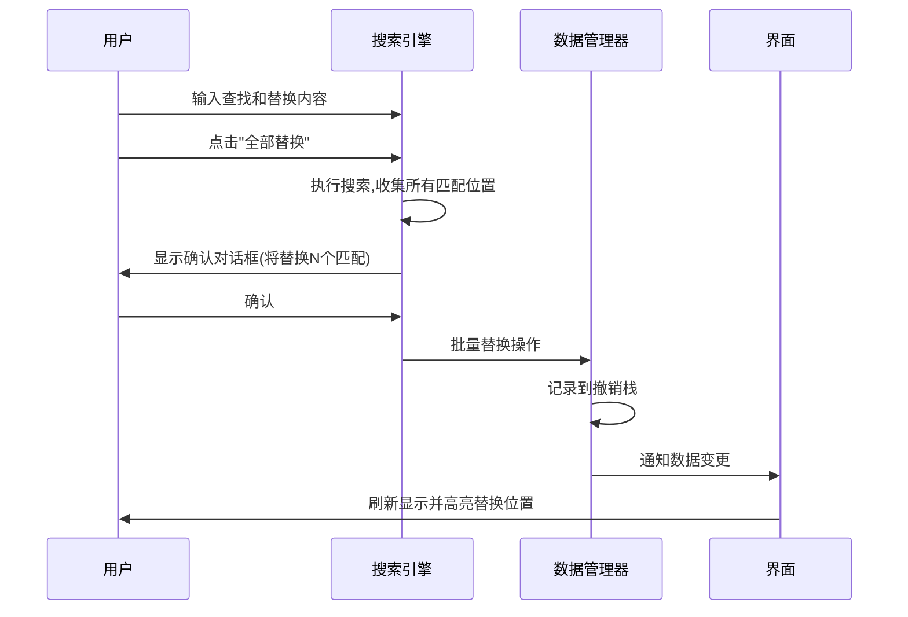

### 4.6 编码支持

#### 4.6.1 支持的编码列表

| 编码名称 | 说明 | 应用场景 |
|----------|------|----------|
| UTF-8 | 变长Unicode编码 | 现代文本文件默认编码 |
| UTF-16 LE | 小端UTF-16 | Windows系统文本 |
| UTF-16 BE | 大端UTF-16 | 网络传输 |
| ASCII | 单字节ASCII | 纯英文文本 |
| GBK | 中文国标扩展 | 简体中文Windows |
| GB2312 | 中文国标 | 简体中文 |
| Big5 | 繁体中文 | 繁体中文系统 |
| Shift-JIS | 日文 | 日文系统 |
| ISO-8859-1 | 西欧字符 | Latin-1 |

#### 4.6.2 编码切换影响

**切换编码时**:
- 底层字节数据保持不变
- 仅影响ASCII区域的解码显示
- 重新解码所有可见字节
- 不可解码字符显示为替代符"�"

### 4.7 撤销/重做机制

#### 4.7.1 操作记录结构

| 字段 | 类型 | 说明 |
|------|------|------|
| 操作类型 | 枚举 | 修改/插入/删除 |
| 起始偏移 | 整数 | 操作起始位置 |
| 原始数据 | 字节数组 | 操作前的数据 |
| 新数据 | 字节数组 | 操作后的数据 |
| 时间戳 | 时间 | 操作时间 |

#### 4.7.2 撤销栈管理

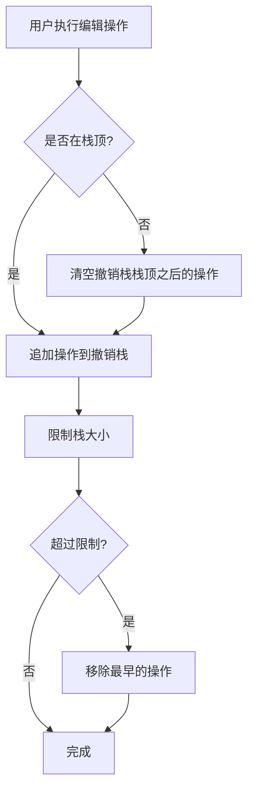

**栈大小限制**:
- 默认保留最近100个操作
- 可在设置中配置
- 超限时自动移除最早的操作

## 5. 扩展功能设计

### 5.1 数据检查器 (Data Inspector)

**功能目标**:
在当前光标或选中位置,将字节解释为不同的数据类型,辅助开发者理解数据含义。

**支持的数据类型**:

| 数据类型 | 字节长度 | 字节序选项 | 示例值 |
|----------|----------|------------|--------|
| Int8 (有符号) | 1 | - | -128 ~ 127 |
| UInt8 (无符号) | 1 | - | 0 ~ 255 |
| Int16 | 2 | 大端/小端 | -32768 ~ 32767 |
| UInt16 | 2 | 大端/小端 | 0 ~ 65535 |
| Int32 | 4 | 大端/小端 | 整数 |
| UInt32 | 4 | 大端/小端 | 无符号整数 |
| Int64 | 8 | 大端/小端 | 长整数 |
| Float32 | 4 | 大端/小端 | 单精度浮点 |
| Float64 | 8 | 大端/小端 | 双精度浮点 |
| 时间戳 | 4/8 | - | Unix时间戳 |

**界面布局**:
- 侧边栏或浮动面板形式
- 实时跟随光标位置更新
- 每个类型一行,显示类型名称和解释值

### 5.2 字节统计分析

**统计指标**:

| 指标 | 说明 |
|------|------|
| 字节分布直方图 | 0x00-0xFF每个字节值的出现频率 |
| 熵值计算 | 数据的信息熵,判断是否加密或压缩 |
| 最常见字节 | Top 10最频繁出现的字节值 |
| NULL字节比例 | 0x00字节占比 |
| 可打印字符比例 | ASCII可打印字符占比 |

**可视化**:
- 字节分布柱状图
- 熵值指示器
- 统计表格

### 5.3 书签功能

**功能说明**:
用户可以在重要的偏移位置添加书签,便于快速定位。

**书签属性**:

| 属性 | 说明 |
|------|------|
| 偏移地址 | 书签所在位置 |
| 名称 | 用户自定义名称 |
| 颜色标记 | 用于视觉区分 |
| 备注 | 书签的说明文字 |

**界面交互**:
- 侧边栏显示书签列表
- 点击书签跳转到对应位置
- 书签位置在编辑器中用颜色高亮
- 支持快捷键快速添加/删除书签

### 5.4 文件比较 (Diff)

**功能目标**:
对比两个文件或两个版本的字节差异。

**比较模式**:
- 并排对比:左右两列显示两个文件
- 差异高亮:不同的字节用颜色标记
- 差异导航:提供上一处/下一处差异跳转

**差异统计**:
- 相同字节数
- 不同字节数
- 差异百分比

### 5.5 数据模板 (Templates)

**功能目标**:
定义数据结构模板,自动解析复杂的二进制格式。

**模板示例** (PNG文件头):

| 字段名 | 偏移 | 长度 | 类型 | 说明 |
|--------|------|------|------|------|
| 签名 | 0x00 | 8 | 固定值 | PNG文件签名 |
| 块长度 | 0x08 | 4 | UInt32BE | IHDR块长度 |
| 块类型 | 0x0C | 4 | ASCII | "IHDR" |
| 宽度 | 0x10 | 4 | UInt32BE | 图像宽度 |
| 高度 | 0x14 | 4 | UInt32BE | 图像高度 |

**模板应用**:
- 加载模板后自动解析并显示结构化视图
- 字段名称显示在对应字节旁
- 支持自定义模板

### 5.6 校验和计算

**支持的算法**:

| 算法 | 输出长度 | 应用场景 |
|------|----------|----------|
| CRC32 | 4字节 | 文件完整性校验 |
| MD5 | 16字节 | 文件指纹 |
| SHA-1 | 20字节 | 签名校验 |
| SHA-256 | 32字节 | 安全哈希 |
| SHA-512 | 64字节 | 高安全哈希 |

**计算范围**:
- 整个文件
- 当前选中区域
- 指定偏移范围

### 5.7 导出功能

**导出格式**:

| 格式 | 说明 | 应用场景 |
|------|------|----------|
| C语言数组 | `unsigned char data[] = {...}` | 嵌入式开发 |
| Python字节串 | `b'\x48\x65\x6C\x6C\x6F'` | Python脚本 |
| Base64 | 编码为Base64字符串 | 文本传输 |
| Intel HEX | .hex格式 | 固件烧录 |
| 纯文本 | 仅导出ASCII内容 | 文本提取 |

### 5.8 位编辑器 (Bit Editor)

**功能说明**:
在字节级别之下,提供单个位(bit)的编辑能力。

**界面设计**:
- 选中某个字节时,显示8个位的二进制表示
- 每个位可单独点击翻转(0↔1)
- 实时显示位操作后的字节值

### 5.9 大文件支持

**策略**:
- 延迟加载:仅加载可见区域的数据
- 分块读取:将文件分成固定大小的块
- 虚拟滚动:支持平滑滚动大文件
- 内存映射:使用内存映射文件技术

**性能目标**:
- 支持GB级别文件打开
- 滚动响应时间 < 100ms
- 搜索进度实时反馈

### 5.10 脚本扩展

**功能目标**:
允许用户编写简单脚本,批量处理数据。

**脚本能力**:
- 读取指定偏移的字节
- 修改字节值
- 循环和条件判断
- 调用内置函数(如编码转换、校验和计算)

**示例场景**:
- 批量替换特定模式
- 数据加密/解密
- 格式转换

## 6. 用户交互流程

### 6.1 打开文件流程

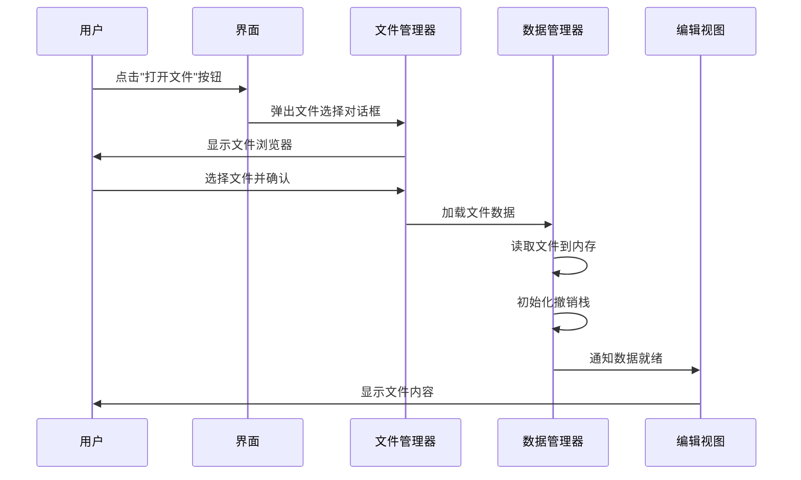

### 6.2 粘贴文本流程

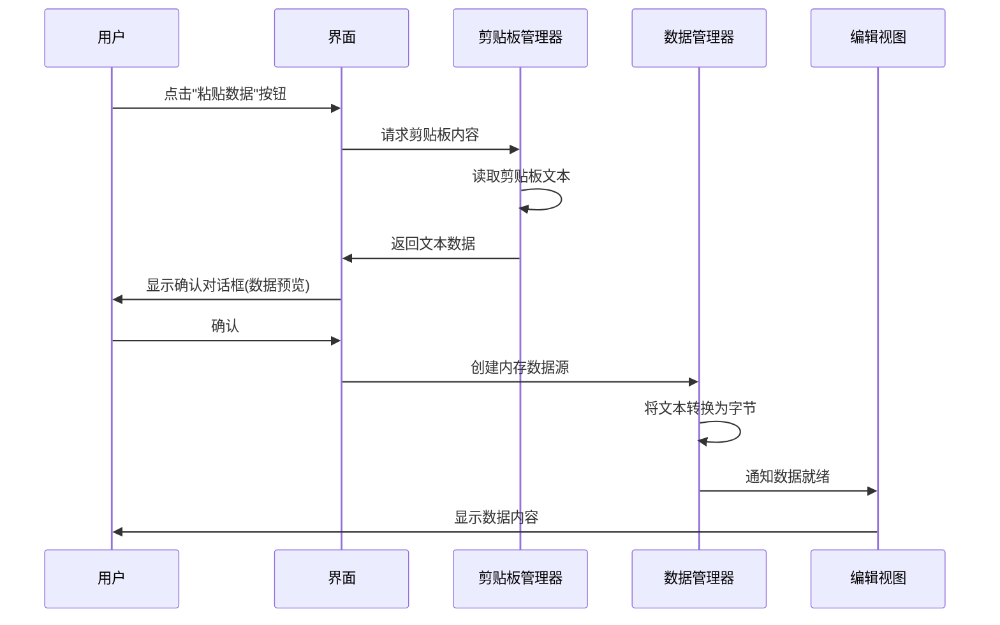

### 6.3 编辑操作流程

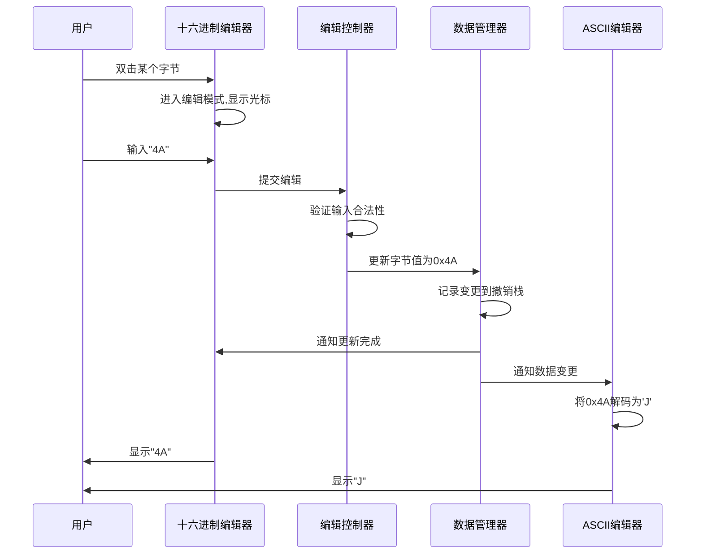

### 6.4 搜索操作流程

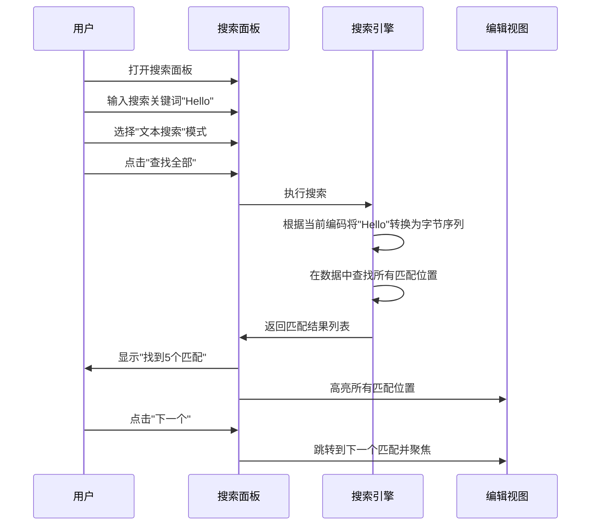

### 6.5 保存文件流程

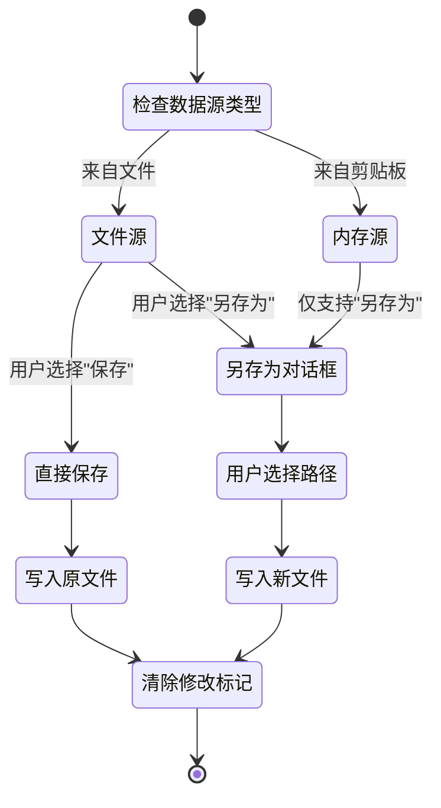

## 7. 数据模型

### 7.1 核心数据模型

#### 7.1.1 字节缓冲区模型

| 属性 | 类型 | 说明 |
|------|------|------|
| 数据缓冲区 | 字节数组 | 存储实际字节数据 |
| 总字节数 | 整数 | 数据长度 |
| 是否修改 | 布尔 | 标记是否有未保存修改 |
| 数据源信息 | 对象 | 文件路径或"剪贴板" |

#### 7.1.2 编辑操作模型

| 属性 | 类型 | 说明 |
|------|------|------|
| 操作ID | UUID | 唯一标识 |
| 操作类型 | 枚举 | 修改/插入/删除/替换 |
| 起始偏移 | 整数 | 操作起始位置 |
| 长度 | 整数 | 影响的字节数 |
| 旧数据 | 字节数组 | 操作前的数据快照 |
| 新数据 | 字节数组 | 操作后的数据 |
| 时间戳 | 日期时间 | 操作时间 |

#### 7.1.3 选区模型

| 属性 | 类型 | 说明 |
|------|------|------|
| 起始偏移 | 整数 | 选区起始字节偏移 |
| 结束偏移 | 整数 | 选区结束字节偏移 |
| 选区长度 | 整数 | 选中的字节数 |
| 选区源 | 枚举 | 十六进制区/ASCII区 |

#### 7.1.4 搜索结果模型

| 属性 | 类型 | 说明 |
|------|------|------|
| 结果列表 | 数组 | 所有匹配位置的偏移列表 |
| 当前索引 | 整数 | 当前聚焦的匹配索引 |
| 总匹配数 | 整数 | 匹配总数 |
| 搜索模式 | 枚举 | 十六进制/文本/正则 |
| 搜索参数 | 对象 | 搜索选项配置 |

#### 7.1.5 书签模型

| 属性 | 类型 | 说明 |
|------|------|------|
| 书签ID | UUID | 唯一标识 |
| 偏移地址 | 整数 | 书签位置 |
| 名称 | 字符串 | 书签名称 |
| 颜色 | 颜色值 | 标记颜色 |
| 备注 | 字符串 | 说明文字 |
| 创建时间 | 日期时间 | 创建时间戳 |

### 7.2 配置模型

#### 7.2.1 应用配置

| 配置项 | 类型 | 默认值 | 说明 |
|--------|------|--------|------|
| 默认编码 | 字符串 | "UTF-8" | 启动时的默认字符编码 |
| 每行字节数 | 整数 | 16 | 每行显示的字节数 |
| 字体名称 | 字符串 | "Menlo" | 等宽字体名称 |
| 字体大小 | 整数 | 13 | 编辑器字体大小 |
| 撤销栈大小 | 整数 | 100 | 最大撤销步数 |
| 主题模式 | 枚举 | "浅色" | 浅色/深色 |
| 自动保存间隔 | 整数 | 0 | 自动保存间隔(秒),0表示禁用 |

## 8. 界面设计规范

### 8.1 布局尺寸

| 元素 | 尺寸 | 说明 |
|------|------|------|
| 窗口最小宽度 | 800px | 保证内容可读 |
| 窗口最小高度 | 600px | 保证内容可见 |
| 标题栏高度 | 52px | macOS标准标题栏高度 |
| 工具栏高度 | 44px | macOS工具栏标准高度 |
| 状态栏高度 | 28px | 状态信息显示 |
| 偏移列宽度 | 120px | 固定宽度 |
| 字节间距 | 8px | 十六进制字节之间的间距 |
| 分组间距 | 16px | 每8字节分组的额外间距 |

### 8.2 颜色方案

#### 8.2.1 浅色主题

| 元素 | 颜色 | 用途 |
|------|------|------|
| 背景色 | #FFFFFF | 主背景 |
| 偏移列背景 | #F5F5F5 | 偏移地址列背景 |
| 文本色 | #000000 | 主要文本 |
| 偏移文本色 | #666666 | 偏移地址文本 |
| 选区背景 | #0066CC | 选中区域背景 |
| 选区文本 | #FFFFFF | 选中区域文本 |
| 搜索高亮 | #FFFF00 | 搜索结果背景 |
| 当前搜索 | #FFA500 | 当前聚焦搜索结果 |
| 书签高亮 | #FFE4B5 | 书签位置背景 |
| 修改标记 | #90EE90 | 已修改字节标记 |

#### 8.2.2 深色主题

| 元素 | 颜色 | 用途 |
|------|------|------|
| 背景色 | #1E1E1E | 主背景 |
| 偏移列背景 | #252526 | 偏移地址列背景 |
| 文本色 | #D4D4D4 | 主要文本 |
| 偏移文本色 | #858585 | 偏移地址文本 |
| 选区背景 | #264F78 | 选中区域背景 |
| 选区文本 | #FFFFFF | 选中区域文本 |
| 搜索高亮 | #4B4B00 | 搜索结果背景 |
| 当前搜索 | #6B4B00 | 当前聚焦搜索结果 |
| 书签高亮 | #3E3E2E | 书签位置背景 |
| 修改标记 | #2E4E2E | 已修改字节标记 |

### 8.3 字体规范

| 使用场景 | 字体 | 大小 | 说明 |
|----------|------|------|------|
| 十六进制编辑器 | SF Mono / Menlo | 13px | macOS系统等宽字体 |
| ASCII编辑器 | SF Mono / Menlo | 13px | 与十六进制区域一致 |
| 偏移地址 | SF Mono / Menlo | 12px | 稍小字号 |
| 状态栏 | SF Pro Text | 11px | 系统UI字体 |
| 工具栏按钮 | SF Pro Text | 13px | 系统UI字体 |

### 8.4 交互反馈

#### 8.4.1 鼠标悬停

| 元素 | 效果 |
|------|------|
| 工具栏按钮 | 背景颜色变浅,显示提示信息 |
| 字节单元 | 边框高亮 |
| 书签 | 显示书签详细信息 |

#### 8.4.2 焦点状态

| 元素 | 效果 |
|------|------|
| 编辑中的字节 | 显示光标,背景高亮 |
| 搜索输入框 | 边框高亮(蓝色) |
| 选中按钮 | macOS标准选中样式 |

## 9. 测试策略

### 9.1 单元测试

**测试模块**:

| 模块 | 测试重点 |
|------|----------|
| 编码转换器 | 各种编码的正确转换,边界情况处理 |
| 搜索引擎 | 搜索准确性,性能,边界情况 |
| 编辑控制器 | 编辑操作的正确性,撤销/重做逻辑 |
| 数据管理器 | 数据加载、保存、修改的正确性 |
| 选区管理器 | 选区计算、操作的准确性 |

### 9.2 集成测试

**测试场景**:

| 场景 | 测试内容 |
|------|----------|
| 文件打开到编辑 | 打开文件→编辑→保存完整流程 |
| 搜索和替换 | 搜索→替换→验证结果 |
| 编码切换 | 切换编码后显示正确性 |
| 撤销/重做链 | 多次编辑→撤销→重做的一致性 |
| 大文件处理 | 大文件加载、滚动、搜索性能 |

### 9.3 界面测试

**测试项**:

| 测试项 | 验证内容 |
|--------|----------|
| 布局响应 | 窗口调整时界面正确布局 |
| 主题切换 | 浅色/深色主题切换正确 |
| 交互响应 | 点击、拖拽、快捷键响应及时 |
| 滚动性能 | 大文件滚动流畅度 |
| 高DPI支持 | Retina屏幕显示清晰 |

### 9.4 性能测试

**性能指标**:

| 指标 | 目标值 | 测试方法 |
|------|--------|----------|
| 文件打开时间 | <1秒(100MB文件) | 测量从打开到显示的时间 |
| 搜索响应时间 | <2秒(100MB文件) | 测量搜索完成时间 |
| 编辑响应延迟 | <50ms | 测量输入到显示的延迟 |
| 内存占用 | <2GB(处理1GB文件) | 监控内存使用 |
| 滚动帧率 | ≥60fps | 测量滚动时的帧率 |
